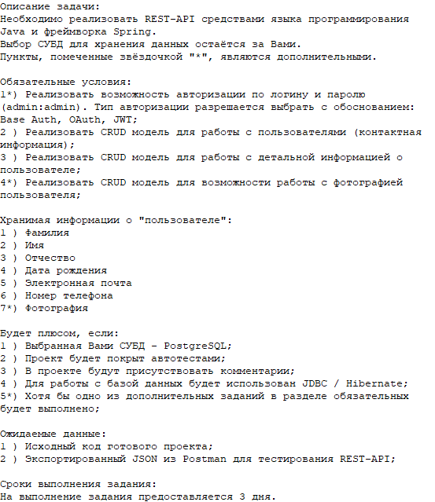

# Тестовое задание для ТЕЛРОС
[Java-бэкэнд разработчик](https://hh.ru/vacancy/108418026)

## Требования:

## Инструкция:
Для запуска приложения потребуется БД Postgres.  
Настройки подключения находятся в файле db.properties.  
Postman запросы находятся в папке docs.   
Так же на проекте есть Swagger доступный по [ссылке.](http://localhost:8080)

## Обоснования архитектурных решений:
- ### Аутентификация
>***В качестве механизма аутентификации выбраны JWT токены, так как это является текущим стандартом в индустрии***

- ### Дизайн таблиц в реляционной БД
>***Было решено сделать три таблицы (users, contacts и user_photos), так как это оптимальный вариант нормализации требуемых данных***

- ### Выбор repository/DAO
>***Был выбран вариант с использованием Spring Data JPA репозиториев, так как не хватало времени реализовать DAO на Hibernate или Spring JDBC Template, хотя это и не проблема сделать.  
PS Если под JDBC имелось ввиду Java JDBC API то это тоже не проблема, но надо понимать насколько это низкоуровнево и сколько времени на это потребуется.***

